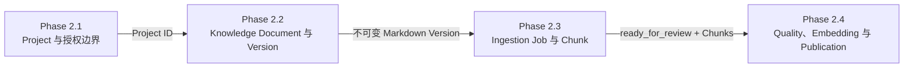

# Phase 2 最终实际实现路线

Date: 2026-07-15
Status: Phase 2.1～2.4 completed; next phase not started

## 1. 文档定位与事实来源

本文记录 Phase 2 最终实际实现结果，不再作为尚未落地功能的前瞻规划。发生冲突时，
事实优先级依次为：当前代码、Alembic Migration 与数据库模型、当前测试、
`docs/status/` 下的最终小节记录、`AGENTS.md`、`README.md`，最后才是历史计划。

已经取消的旧设计不得因为出现在旧讨论或旧计划中而恢复。后续阶段尚未开始，也不能
依据本文自动继续开发。

## 2. Phase 2 最终目标与边界

Phase 2 完成了管理员侧“项目资料进入可发布知识库”的生产链路：

```text
Project
→ Knowledge Document
→ Document Version
→ Ingestion Job
→ Cleaning
→ Chunking
→ Rule Check
→ DeepSeek Indexability Check
→ Embedding
→ PostgreSQL + pgvector
→ Publish / Supersede / Unpublish
```

最终交付的是可管理、可版本化、可异步处理、可安全判断、可向量化、可显式发布和下线的
知识库。Phase 2 不包含用户问题检索、Retriever、RAG 回答、LangGraph、Chat、SSE、
多轮对话、BM25、RRF、Reranker、Web Search 或大 Agent。

## 3. Phase 2.1～2.4 实际完成内容

### 3.1 Phase 2.1 — 项目管理产品切片

完成内容：

- 管理员 Project 创建、列表、详情、编辑和删除；
- Project 被 Access Grant 引用时的删除保护；
- 管理员项目管理和 Access Grant 管理前端；
- Recruiter Access Token Exchange 入口与授权项目页面；
- 管理员与 Recruiter 使用相互隔离的 HttpOnly Cookie 和 Redis Session；
- 每次 Recruiter 授权访问都由 PostgreSQL 重校验 Grant 状态和项目范围。

本节建立后续知识文档必须归属的 `Project`，并保留 Phase 1 的授权和身份隔离边界。

### 3.2 Phase 2.2 — 知识文档与版本管理

完成内容：

- `knowledge_documents` 逻辑文档；
- `document_versions` 不可变版本；
- Markdown 文本粘贴和 `.md` 文件上传；
- 同一文档的 v1、v2 等递增版本；
- 文档列表、详情、标题编辑、版本创建和版本查看页面；
- 原始 Markdown 以字面文本安全预览，不执行其中的 HTML 或脚本；
- 大小、UTF-8、扩展名、NUL 字符、文件名和重复内容校验。

本节使每份资料形成 `Project → KnowledgeDocument → DocumentVersion` 的持久化关系，
但不处理正文，也不发布。

### 3.3 Phase 2.3 — 异步处理与 Chunk 构造

完成内容：

- PostgreSQL 持久化 `ingestion_jobs`；
- Redis + ARQ 队列和独立 Worker；
- `202 Accepted + job_id` 的长任务 API；
- 确定性 Markdown 清洗；
- Markdown 标题、段落和 fenced code aware 的 Chunking；
- `document_chunks`、稳定顺序、标题路径、字符数和内容哈希；
- Job 状态查询、处理进度页面和 Chunk 查看页面；
- 处理成功后版本进入 `ready_for_review`。

本节消费 Phase 2.2 的不可变 `raw_content`，输出供 Phase 2.4 判断和向量化的 Chunks。

### 3.4 Phase 2.4 — 知识增强、向量化与发布

完成内容：

- LLM 之前执行确定性 Rule Check；
- Hard Secret 阻断，秘密正文不外发；
- 手机号、邮箱 PII Warning，外发前脱敏并默认不进入最终索引；
- `too_long` 普通 Warning，用于发现 Chunking 回归；
- DeepSeek V4 Pro 最小结构化可索引判断和 Metadata 提取；
- `auto_indexable` 自动建议与 `enabled` 最终管理员开关；
- 通用 `EmbeddingProvider` Protocol、唯一真实
  `OpenAICompatibleEmbeddingProvider`、测试用 Fake 和安全失败用 Unconfigured Provider；
- 当前智谱 `embedding-3`、1024 维、批大小 10 的实际配置；
- PostgreSQL `vector` 扩展和 `chunk_embeddings`；
- provider、model、dimensions、Chunk `content_hash` 完整性校验；
- 单一 `knowledge_indexing` Job，内部阶段为 `rule_check`、`llm_quality_check`、
  `embedding`、`saving`；
- `ready_to_publish`、`published`、`superseded` 和当前发布版本关系；
- 原子发布、新旧版本切换和文档下线；
- 管理员启动索引、查看判断摘要、启停 Chunk、查看 Job、发布和下线的前端流程。

本节消费 Phase 2.3 的 `ready_for_review` 版本和 Chunks，输出完整且可显式发布的向量知识。

## 4. 小节之间的数据依赖



主要持久化关系为：

```text
Project 1 ── * KnowledgeDocument
KnowledgeDocument 1 ── * DocumentVersion
KnowledgeDocument 0 ── 1 current_published_version
DocumentVersion 1 ── * IngestionJob
DocumentVersion 1 ── * DocumentChunk
DocumentChunk 1 ── * ChunkEmbedding
```

`ChunkEmbedding` 的业务身份由 `chunk_id + provider_name + model_name + dimensions` 唯一确定；
发布时还必须验证其 `content_hash` 等于当前 Chunk 的 `content_hash`。

## 5. 最终端到端数据流

```text
管理员登录
→ 创建 Project
→ 创建 Knowledge Document
→ 粘贴 Markdown 或上传 .md，生成 Document Version
→ 创建 document_processing Job
→ Redis/ARQ 将 Job UUID 交给 Worker
→ Worker 清洗并切分 Chunk
→ Version 进入 ready_for_review
→ 创建 knowledge_indexing Job
→ Rule Check 先阻断 Secret，并对 PII 做脱敏
→ DeepSeek 返回严格结构化的最小索引判断
→ 自动建议写入 auto_indexable，首次默认同步 enabled
→ 仅对 enabled=true 的 Chunk 生成 Embedding
→ 向量及其 provider/model/dimensions/content_hash 写入 pgvector
→ 完整性通过后 Version 进入 ready_to_publish
→ 管理员显式发布
→ 新版本成为 current published，旧版本成为 superseded
→ 管理员可将 current_published_version_id 清空以便下线
```

新版本尚未完成并发布前，旧的当前发布版本继续有效。

## 6. 组件职责

| 组件 | Phase 2 最终职责 |
| --- | --- |
| PostgreSQL | 保存 Project、Grant 关系、文档、版本、Job、Chunk、Embedding 身份和发布状态，是耐久业务事实来源。 |
| pgvector | 在 PostgreSQL 内保存 Chunk 向量；本阶段只负责写入和完整性，不执行向量检索。 |
| Redis | 保存管理员/Recruiter 临时 Session、限流计数并承载 ARQ 队列；不保存唯一文档或发布事实。 |
| FastAPI | 提供管理员认证保护的 Project、文档、处理、索引、Chunk 修正和发布 API；请求路径不执行长任务。 |
| ARQ Worker | 执行清洗、Chunking、Rule Check、DeepSeek 判断、Embedding 和持久化步骤。 |
| Rule Check | 在外部调用之前确定性识别秘密、PII、重复和异常内容，决定可否外发及脱敏内容。 |
| DeepSeek V4 Pro | 只对当前批次返回可索引建议、issues、knowledge type、topics、technologies 和 reason；不生成向量、不改正文、不决定权限。 |
| EmbeddingProvider | 为业务层提供厂商无关的批量向量接口；当前真实实现通过 OpenAI-compatible 配置切换服务。 |
| React 管理端 | 提供 Project、Grant、文档、版本、Job、Chunk 判断/启停和发布/下线页面。 |

## 7. 已取消且不得恢复的旧设计

Phase 2 最终没有以下内容：

- Frozen Knowledge 或独立冻结状态；
- 独立 `chunk_quality_evaluations` 历史表；
- `quality_score` 或复杂多维评分；
- Prompt 版本、token usage 或 latency 持久化；
- 三态 Override、管理员审批信息或逐 Chunk 人工审批流；
- 独立质量报告平台或企业级质量仪表盘；
- 厂商专用 Embedding Provider 类或多厂商 Factory；
- 独立 Quality Job 和独立 Embedding Job；
- Phase 2 内的 Retriever、RAG 或 LangGraph。

管理员对 `enabled` 的简单启停是最终纠偏开关，不等同于复杂人工审批平台。

## 8. 安全与发布约束

- 所有管理接口继续使用独立管理员认证，Recruiter 不能创建、修改、索引、发布或删除资料；
- PostgreSQL 始终是授权和发布关系的事实来源，模型不能创建或扩大权限；
- 外部模型调用有有限批次、有限超时和有限重试；
- API Key 使用 `SecretStr` 和环境变量，不返回前端、不进入日志或 Git；
- Hard Secret 不外发，PII 外发前脱敏；
- LLM 输出经过严格 Pydantic 校验，Chunk ID 必须与服务器当前批次完全一致；
- 仅 `enabled=true` Chunk 可生成向量；
- 发布要求每个 enabled Chunk 都有匹配当前 provider、model、dimensions 和 content hash 的 Embedding；
- 未发布版本不能成为未来 Recruiter 检索材料；
- 本阶段没有实现检索，因此不能把“已发布”表述为“面试官已经可以问答”。

## 9. Phase 2 完成状态

Phase 2.1～2.4 已完成并有各自状态记录。完整总结见
[`PHASE2_SUMMARY.md`](PHASE2_SUMMARY.md)，Phase 2.4 的细节见
[`status/PHASE_2_4_STATUS.md`](status/PHASE_2_4_STATUS.md)。

下一阶段尚未开始。任何 Retriever、RAG、LangGraph、Chat 或 SSE 工作都必须先获得用户
新的明确确认、定义新的范围和验收条件，并遵守新的小节检查点流程。
