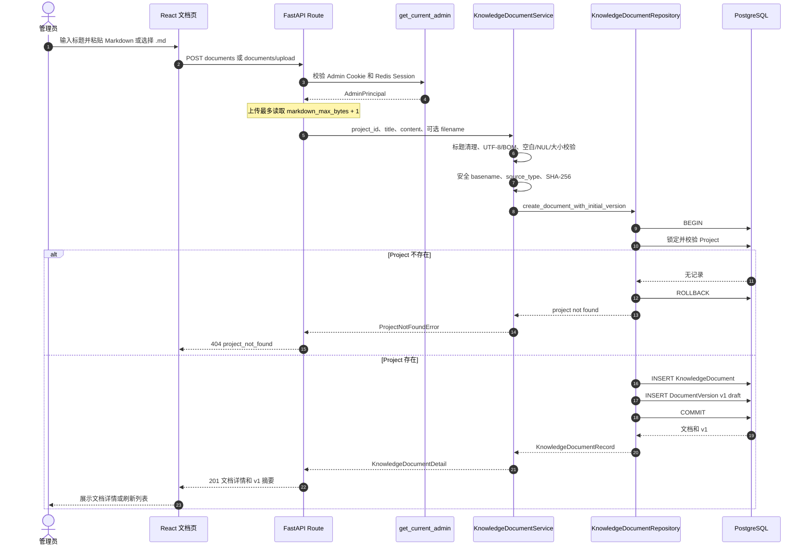
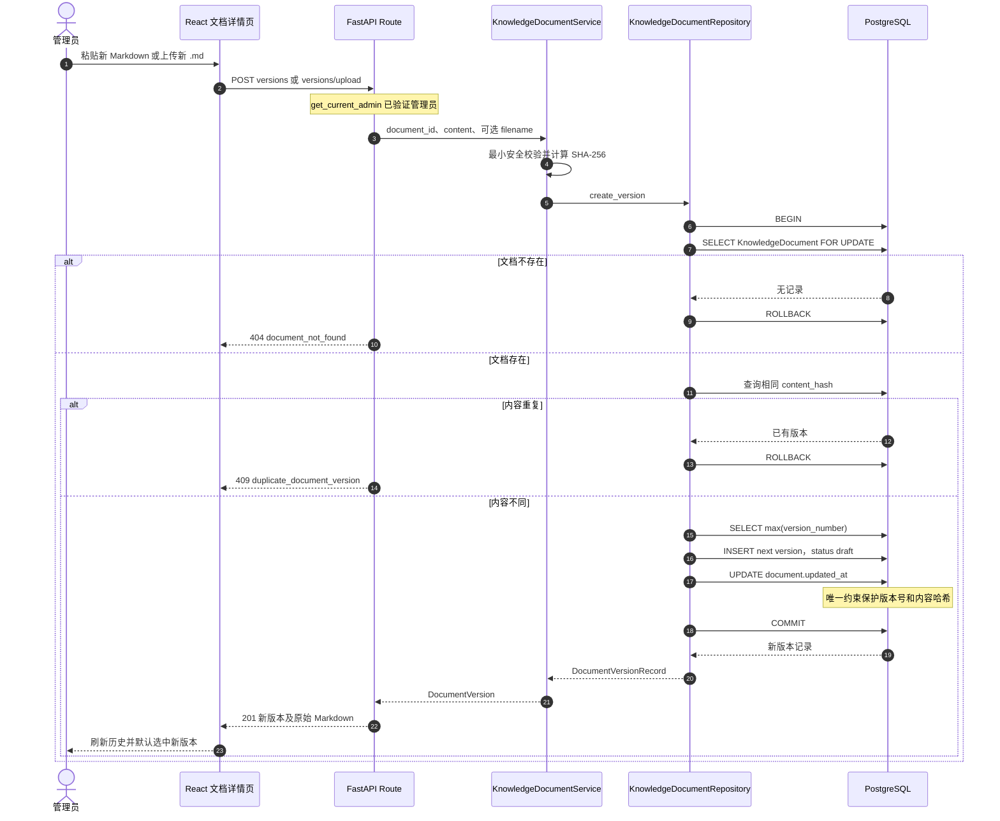
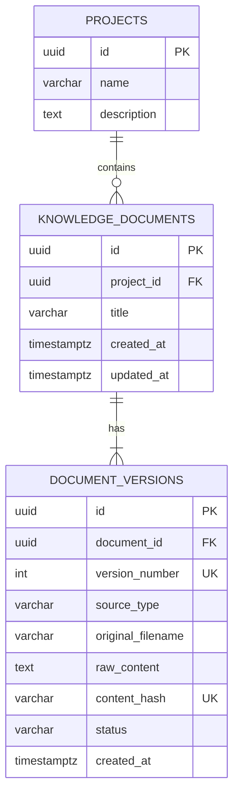

# Phase 2.2 架构图：知识文档与版本管理

本文只描述 Phase 2.2 已实现的系统。虚线“未来边界”仅表示知识版本可被后续能力消费，不表示 Job、Worker、Chunk、Embedding、RAG、LangGraph 或 Chat 已实现。

## 1. 当前系统架构图

```mermaid
flowchart LR
    Admin[管理员浏览器]

    subgraph Frontend[React + TypeScript 管理端]
        Projects[项目管理页]
        ProjectDocs[项目知识文档页]
        DocDetail[文档详情与版本历史]
        ApiClient[Typed API Client<br/>credentials include]
    end

    subgraph FastAPI[FastAPI 应用]
        Auth[get_current_admin]
        Routes[Admin Document Routes<br/>JSON + multipart]
        Service[KnowledgeDocumentService<br/>验证、SHA-256、业务规则]
        Repo[KnowledgeDocumentRepository<br/>查询、事务、行锁]
    end

    subgraph Data[基础设施]
        Redis[(Redis<br/>Admin Session)]
        ProjectsTable[(projects)]
        DocsTable[(knowledge_documents)]
        VersionsTable[(document_versions)]
    end

    Future[未来处理与检索边界<br/>当前未实现]

    Admin --> Projects
    Projects --> ProjectDocs
    ProjectDocs --> DocDetail
    Projects --> ApiClient
    ProjectDocs --> ApiClient
    DocDetail --> ApiClient
    ApiClient --> Routes
    Routes --> Auth
    Auth --> Redis
    Routes --> Service
    Service --> Repo
    Repo --> ProjectsTable
    Repo --> DocsTable
    Repo --> VersionsTable
    ProjectsTable -->|1 对多| DocsTable
    DocsTable -->|1 对多| VersionsTable
    VersionsTable -. 原始 draft 版本 .-> Future
```

关键边界：

- Admin 与 Recruiter 的 Cookie/Session 仍然分离；文档接口只接受 Admin；
- Route 不执行 SQL，Service 不依赖 FastAPI Request/Response，Repository 不返回 HTTP 对象；
- PostgreSQL 保存文档事实，Redis 不保存文档内容；
- 前端只通过安全响应访问内容，不读取 HttpOnly Cookie；
- `document_versions.raw_content` 是原始事实，列表接口不返回完整内容。

## 2. 文档创建流程图

文档和 v1 共用同一个事务。任何数据库失败都会回滚，不会留下没有初始版本的逻辑文档。

## 3. 文档版本流程图

同一 Knowledge Document 的并发版本创建通过行锁串行分配版本号；数据库唯一约束承担最终一致性保护。旧版本不会被更新或覆盖。

## 4. 当前数据关系

`version_number` 与 `content_hash` 都是在同一个 `document_id` 范围内唯一。所有版本当前均为 `draft`，且没有级联删除、文档删除或版本删除 API。

## 5. 停止边界

本架构文档没有进入 Phase 2.3。当前不存在 Job、Worker、Chunk、Embedding、pgvector、发布、RAG、LangGraph 或 Chat 实现；这些能力只有在用户明确确认相应阶段后才能设计和实现。

