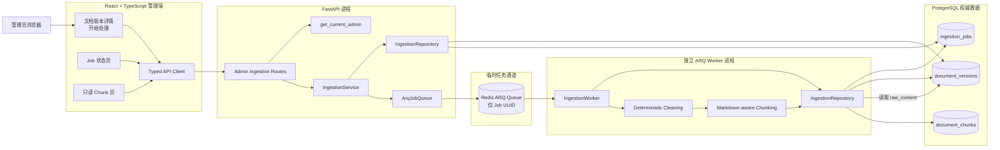
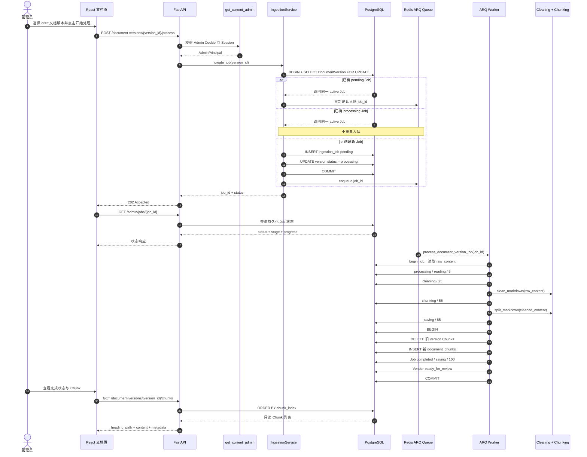
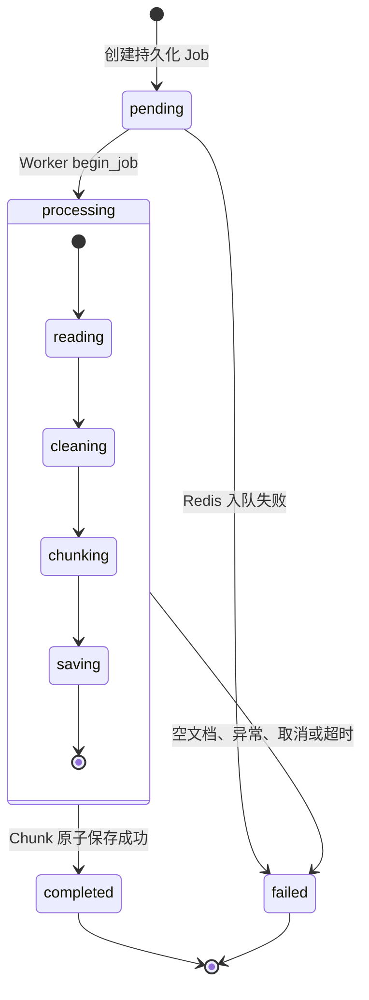
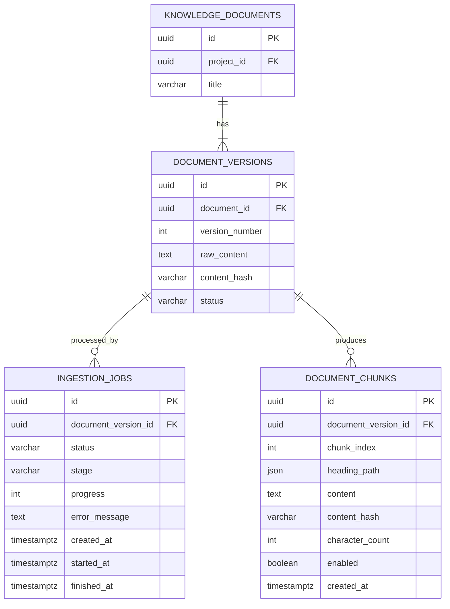
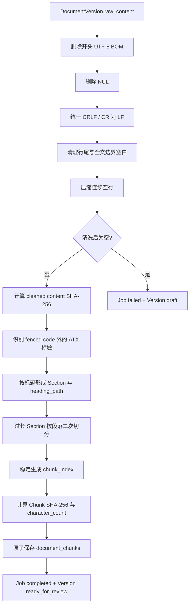

# Phase 2.3 架构图：异步文档处理与 Chunk 切分

本文只描述 Phase 2.3 已实现的文档处理边界：管理员创建持久化 Job，独立 ARQ Worker 执行确定性 Cleaning 和 Markdown-aware Chunking，PostgreSQL 保存权威状态与 Chunk。本文不表示 Chunk 审核、发布、Embedding、pgvector、Retriever、RAG、LangGraph、Chat 或 SSE 已实现。

## 1. 文档处理整体架构

关键边界：

- FastAPI 只认证管理员、创建 Job、投递 Job UUID、查询 PostgreSQL 状态；
- Worker 与 FastAPI 是独立进程，并拥有自己的数据库连接池和生命周期；
- Redis 只负责临时任务投递，不是 Job、版本或 Chunk 的事实来源；
- PostgreSQL 保存 `DocumentVersion`、Job 状态机和最终 Chunk；
- 队列载荷不包含原始 Markdown、Cookie、Token 或管理员身份；
- 所有三个管理 API 都依赖 `get_current_admin`，Recruiter Session 不能访问。

## 2. 文档处理流程图

失败边界：

- 入队失败：Job 写为 `failed`，版本恢复 `draft`，API 返回脱敏 503；
- 清洗后为空或处理异常：Worker 写入固定安全错误，Job 进入 `failed`，版本恢复 `draft`；
- Worker 取消或超时：尽力持久化 `failed` 后重新抛出取消；
- PostgreSQL 错误：Service/API 只暴露统一脱敏错误，不返回驱动异常。

## 3. Job 状态流转图

`status` 与 `stage` 分离：

- `status` 表示 Job 生命周期：`pending | processing | completed | failed`；
- `stage` 表示 Pipeline 位置：`reading | cleaning | chunking | saving`；
- `progress` 当前按 `0 → 5 → 25 → 55 → 85 → 100` 更新；
- PostgreSQL partial unique index 保证一个版本最多一个 active Job。

## 4. Chunk 数据关系图

数据约束：

- `ingestion_jobs.document_version_id` 和 `document_chunks.document_version_id` 删除时随版本级联；
- `(document_version_id, chunk_index)` 唯一且 `chunk_index >= 0`；
- `enabled` 默认 `true`，本阶段没有修改它的 API；
- Chunk 不包含 Embedding、vector、similarity 或 score；
- `ready_for_review` 只表示确定性处理完成，不表示已审核或已发布。

## 5. 处理 Pipeline 组件图

## 6. 当前架构边界

当前终点是持久化的、只读可查看的 `document_chunks` 和版本状态 `ready_for_review`。未实现 Chunk 审核、发布流程、Embedding、pgvector、Retriever、RAG、LangGraph、Chat 或 SSE；这些能力不能从本图推断为已经存在。
