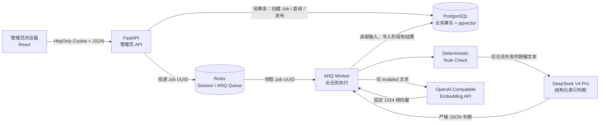
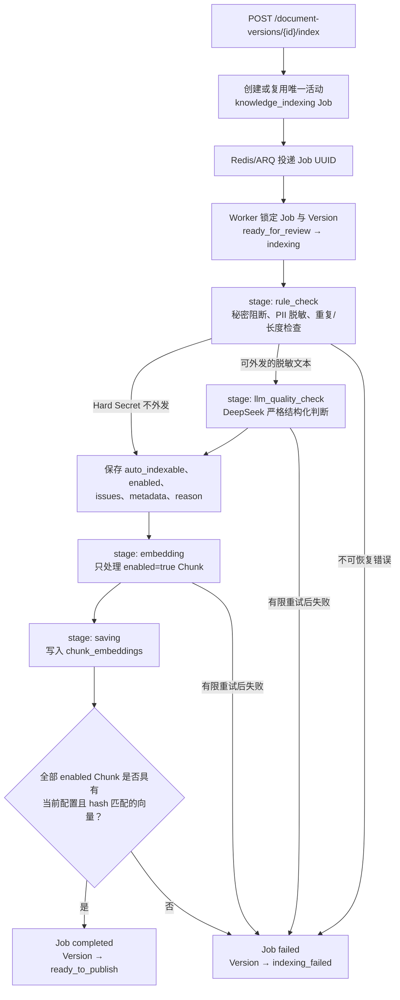
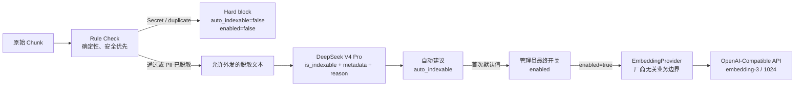
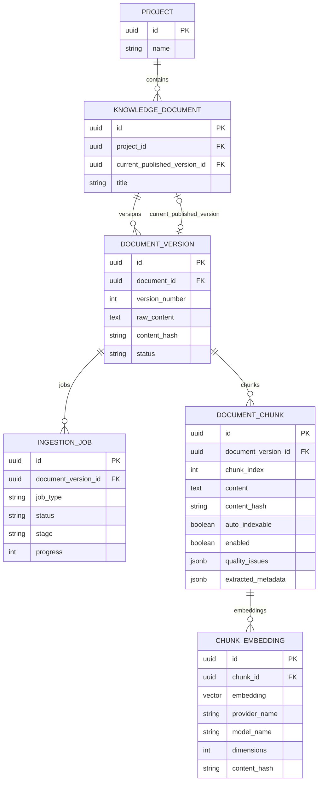
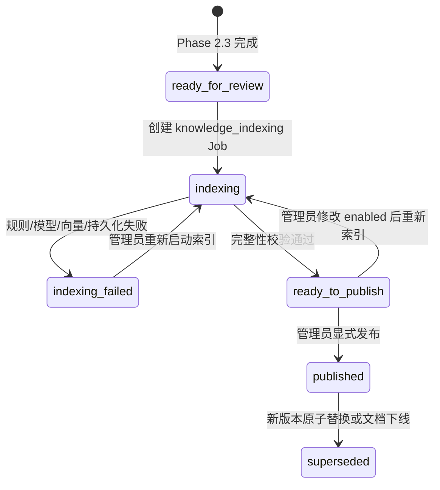
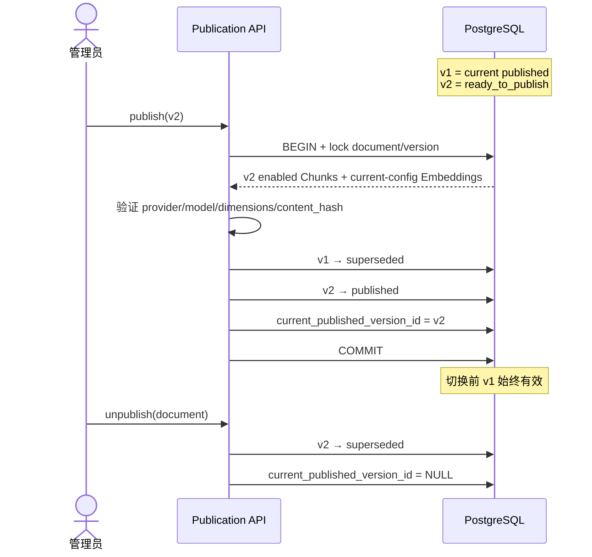

# Phase 2.4 Architecture — Knowledge indexing and publication

Date: 2026-07-15
Scope: implemented Phase 2.4 only; no Retriever, RAG, LangGraph, Chat, or SSE

## 1. 总体架构

PostgreSQL 保存耐久事实；Redis 只协调临时状态和队列；FastAPI 请求不执行长时间模型调用；
Worker 共享并在关闭时释放异步外部 Client。

## 2. knowledge_indexing Job 流程

Job 的 durable `status`、`stage`、`progress` 和安全错误摘要都保存在 PostgreSQL。ARQ 自身不保存
唯一业务结果。

## 3. Rule Check、DeepSeek 与 Embedding 的分工

Rule Check 决定能否外发；DeepSeek 只提供结构化建议；管理员控制最终 `enabled`；Embedding 模型
只生成向量。四者不能相互替代，也都不能创建授权范围。

## 4. Project、Document、Version、Chunk 与 Embedding 关系

`chunk_embeddings` 的唯一约束是
`(chunk_id, provider_name, model_name, dimensions)`。发布完整性还要求向量长度有效、数值有限且
Embedding 的 `content_hash` 与 Chunk 一致。

## 5. 发布、版本切换与下线

版本切换过程：

Phase 2.4 只建立发布关系和完整性，不提供任何面试官检索入口。
