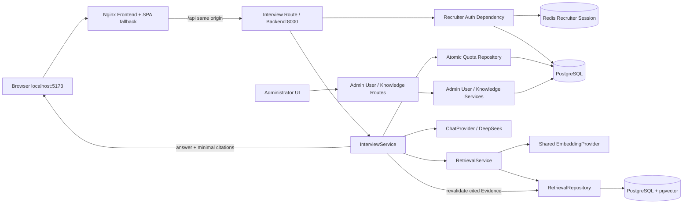
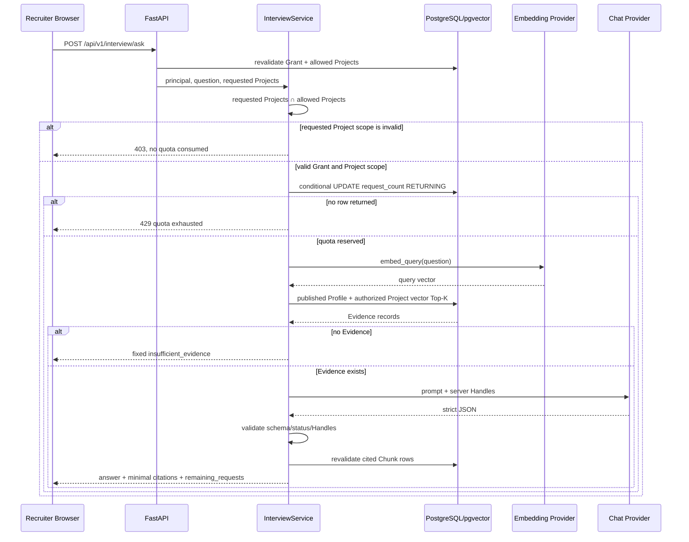
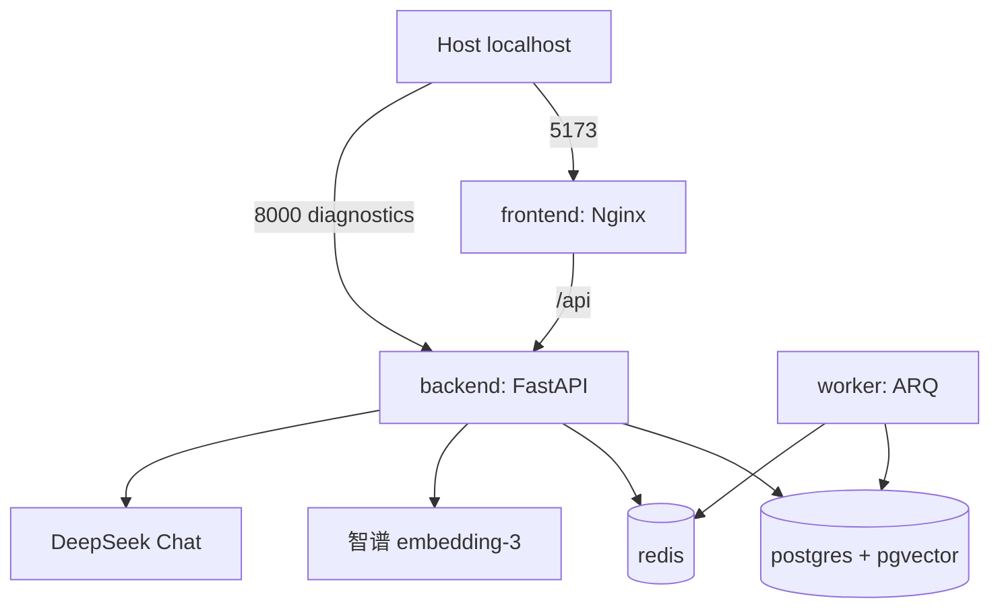

# Phase 3 架构 — Profile + Project 单轮 RAG

## 1. 组件边界



Route 只处理 HTTP 合同和错误映射。Service 编排范围、额度、检索、模型和引用。Repository 拥有
SQL；Provider 隔离外部 HTTP。LLM 不接触数据库、Session、Cookie 或授权决策。

Compose 对宿主只绑定 loopback：Frontend `127.0.0.1:5173`、Backend `127.0.0.1:8000`、
PostgreSQL `127.0.0.1:5432`、Redis `127.0.0.1:6379`。Frontend 的 Nginx 将 `/api` 转发到内部
服务名 `backend:8000`，所以浏览器的 HTML、API 和 HttpOnly Recruiter Cookie 保持同源。

## 2. 一次请求的时序



## 3. 检索 SQL 范围

```text
valid AccessGrant
  ├─ KnowledgeDocument(document_scope = profile, project_id IS NULL)
  │    └─ current_published_version_id → DocumentVersion(published)
  │         └─ DocumentChunk(enabled, no disabled_reason)
  │              └─ ChunkEmbedding(active identity, matching hash)
  └─ GrantProject ─ Project in effective requested scope
                       └─ KnowledgeDocument(document_scope = project)
                            └─ current_published_version_id → DocumentVersion(published)
                                 └─ DocumentChunk(enabled, no disabled_reason)
                                      └─ ChunkEmbedding(active identity, matching hash)
```

Profile 与 Project 两条分支在同一条受约束 SQL 中合并并参与统一 Top-K。Profile 不需要绑定
Project，但仍要求当前 Recruiter Grant 有效；Project 必须同时属于 Grant 授权范围和本次有效请求
范围。客户端若显式提交未授权 Project，服务层返回范围错误，不会退回 Profile 或全部授权项目。

距离由 `ChunkEmbedding.embedding.cosine_distance(query_embedding)` 计算。窗口函数按
`DocumentChunk.content_hash` 编号，只保留距离最小的一行，再按距离和 Chunk ID 稳定排序取
Top-K。Service 还有一层相同哈希防御性去重和上下文字符预算。

## 4. 信任边界

| 数据 | 是否可信 | 处理方式 |
| --- | --- | --- |
| Recruiter Cookie | 否 | 只用于 Redis Session 查找；PostgreSQL 重验证 Grant |
| `project_ids` | 否 | 与当前授权取交集；显式非法范围拒绝；SQL 再连接 `grant_projects` |
| 问题文本 | 否 | 长度限制；只进入 Query Embedding 和受控 Prompt |
| 文档正文 | 否 | Prompt 明确标记为 Evidence，不执行其中指令 |
| 模型 JSON | 否 | Pydantic + Handle + 数据库二次校验 |
| Repository 行 | 有条件可信 | 已通过 SQL 授权/发布/Embedding 不变量 |

## 5. Provider 生命周期

FastAPI lifespan 创建共享 Embedding 和 Chat Provider，复用 HTTP Client，并在应用关闭时释放。
未配置密钥时使用显式 Unconfigured Provider 并安全返回脱敏 503；绝不在生产请求中回退 Fake
Provider。Fake Provider 只用于确定性自动化测试。

## 6. 数据与隐私

本阶段不新增数据库表或 Migration，也不保存问题、答案、reasoning、引用或对话历史。Redis 仍
只存短期 Session 和限流数据。公开 Interview 响应不包含原始向量、完整 Chunk、数据库内部
Chunk/Document ID、Prompt、密钥、Cookie、Session Token 或 Chain of Thought。

## 7. Profile 与 Project 的正式范围决策

Phase 3 复用 Phase 2 已存在的 `KnowledgeDocument.document_scope`，不新增 Migration：

- `profile` 保存教育、简介、技能、获奖、研究和求职方向等候选人全局资料；所有有效 Recruiter
  Grant 都可检索其当前发布内容；
- `project` 保存项目资料，只能由授权该 Project 的 Grant 检索；
- Profile 和 Project 都必须通过相同的发布指针、Chunk 可用性、Embedding 身份与哈希校验；
- 当前仍不实现多简历生命周期、复杂全局去重、高级检索或 Phase 4 Agent 行为。

因此“候选人简历与个人背景”不再需要伪装成普通 Project。管理员通过独立的 Profile 资料入口
上传、处理、审核 Chunk、索引和发布，Recruiter Citation 会明确显示“候选人 Profile”。

## 8. Compose 运行边界



Backend healthcheck只验证 HTTP 进程存活；`/api/v1/health/ready` 另外验证 PostgreSQL 和 Redis。
Frontend 等待 Backend healthy 后启动，自身镜像 healthcheck 验证 Nginx。Worker 不以“容器在跑”
代替队列检查，验收还需确认 ARQ 启动日志已列出两个 Job 函数并读取到 Redis 版本。

## 9. 管理端边界

`/admin/users` 通过独立管理员 API 支持列表、新增和删除。删除在 PostgreSQL 事务中锁定管理员
集合，禁止删除当前登录账号和最后一个管理员，避免并发请求绕过安全不变量。Project/Profile
文档页展示同一条明确工作流：上传版本 → 处理 → Chunk 审核 → 向量索引 → 发布；只有完成发布
的当前版本才能进入 Retriever。
