# Phase 4 架构 — 受授权约束的 LangGraph 多 Agent 面试

## 1. Phase 4 总体架构

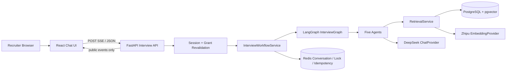

PostgreSQL 是授权和发布知识的事实源；Redis 只保存短期会话与并发控制；LLM 无权创建或扩大项目
范围。

## 2. Supervisor 与四个专业 Agent

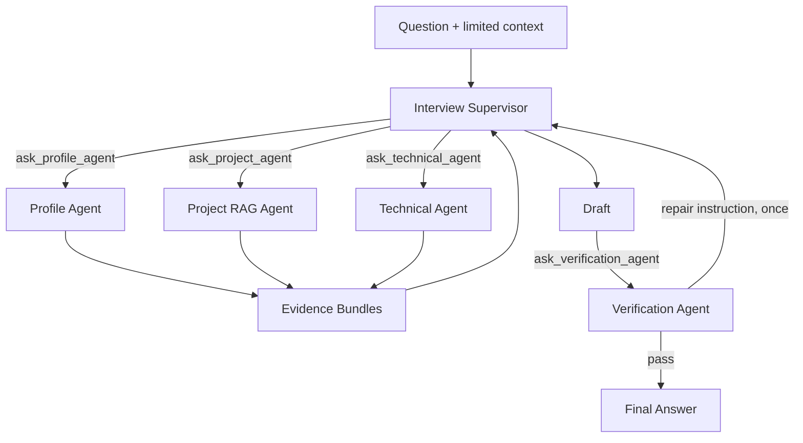

Supervisor 只能把专业 Agent 当作工具，不能直接访问数据库、Embedding 或管理员接口。

## 3. Agent 工具权限

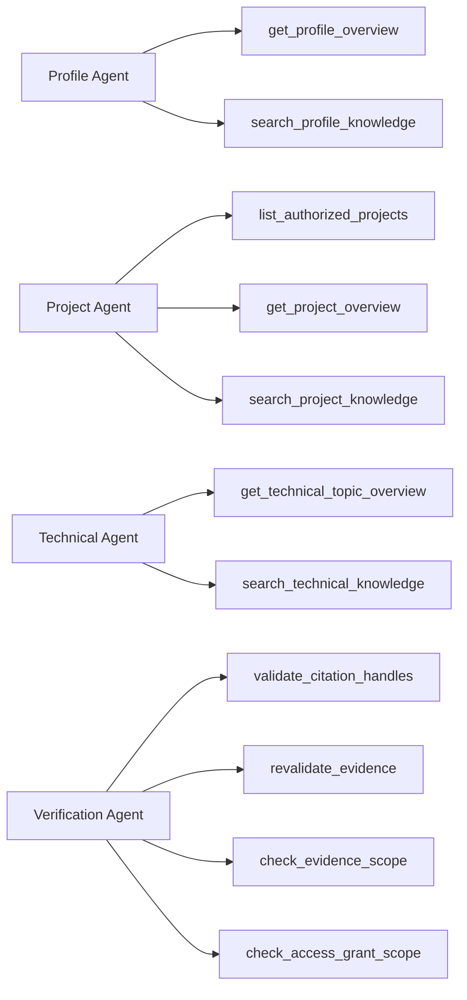

工具由 Python 白名单绑定；Agent 不能按名称构造未知工具，也不能访问其他 Agent 的私有工具。

## 4. Profile / Project / Technical Retrieval

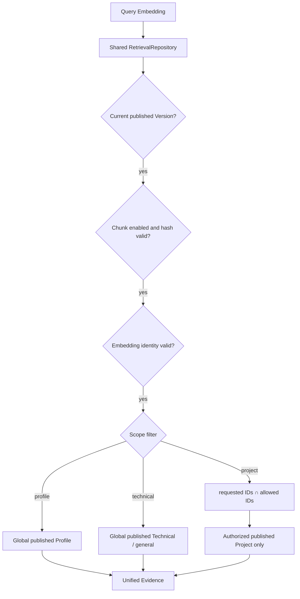

Project 空交集返回受控范围错误，不回退到全部项目。

## 5. 混合问题回答

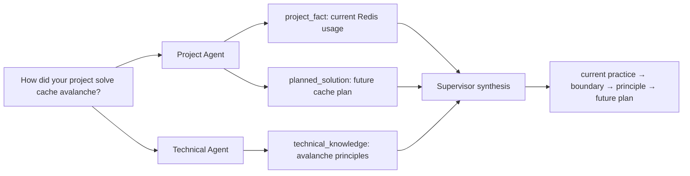

`technical_knowledge` 不能变成“项目已经实现”，`planned_solution` 不能使用完成时表达。

## 6. Verification 与一次修正

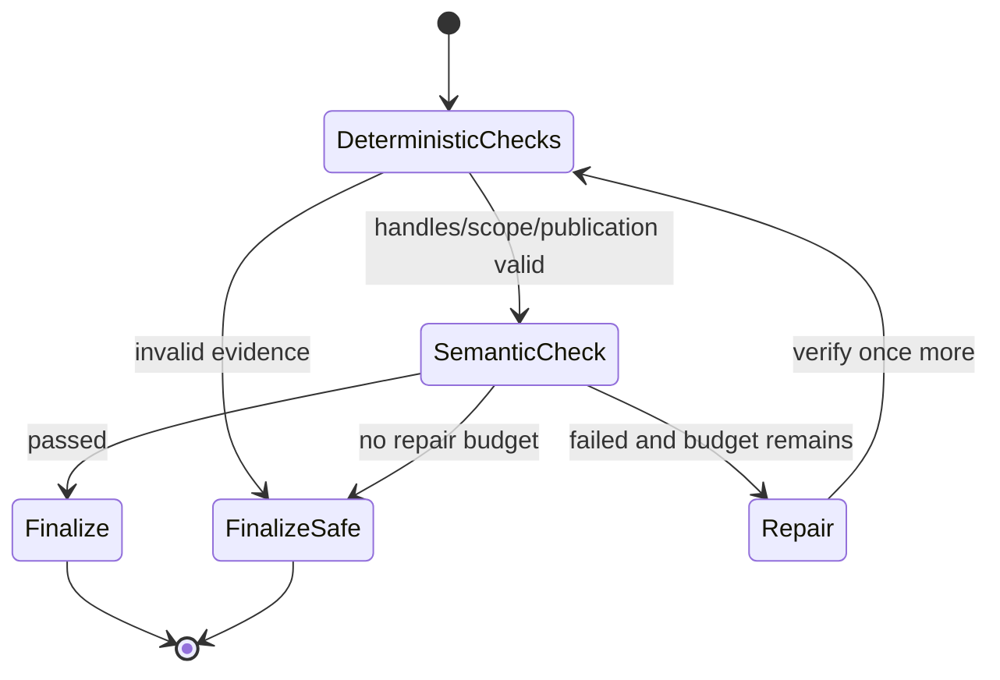

确定性检查重新读取数据库；语义检查识别无证据结论、实现边界混淆、虚构指标和 Prompt 泄露。

## 7. Redis Conversation

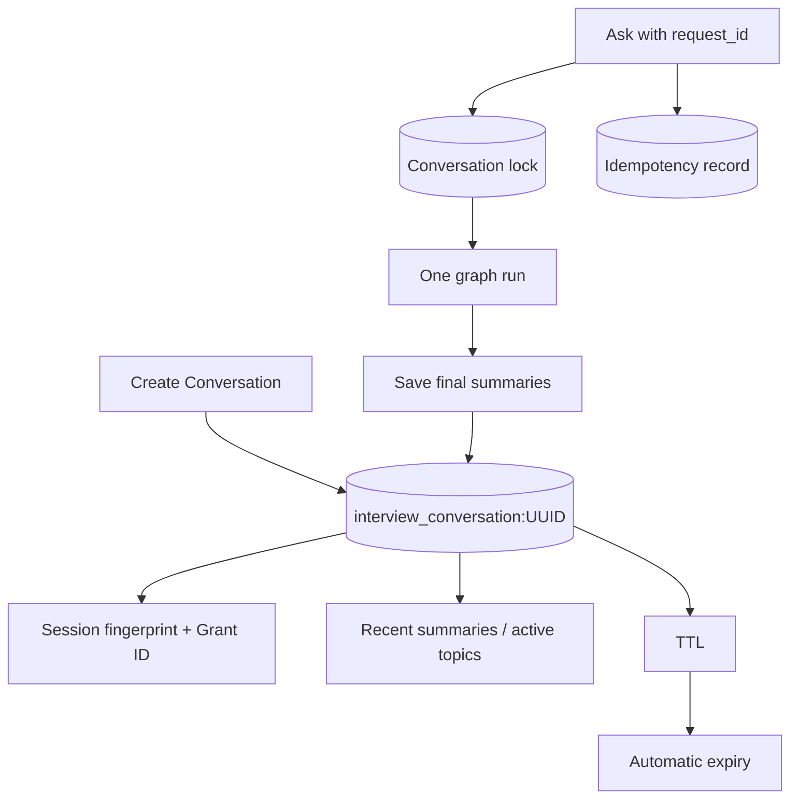

Conversation 不是事实 Evidence，也不创建永久 Message 表。

## 8. SSE 公开状态

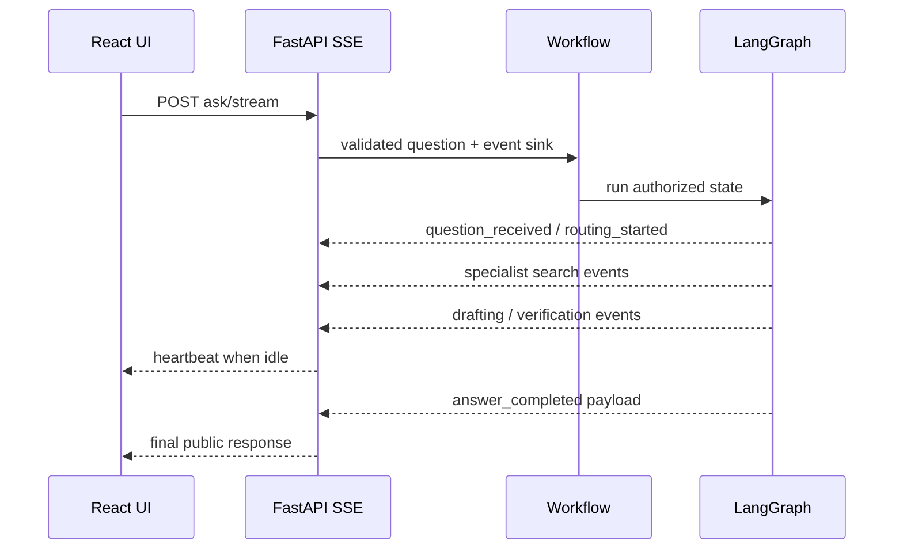

SSE 不发送 Chain of Thought、Prompt、SQL、完整 Evidence 或工具原始参数。

## 9. request_count

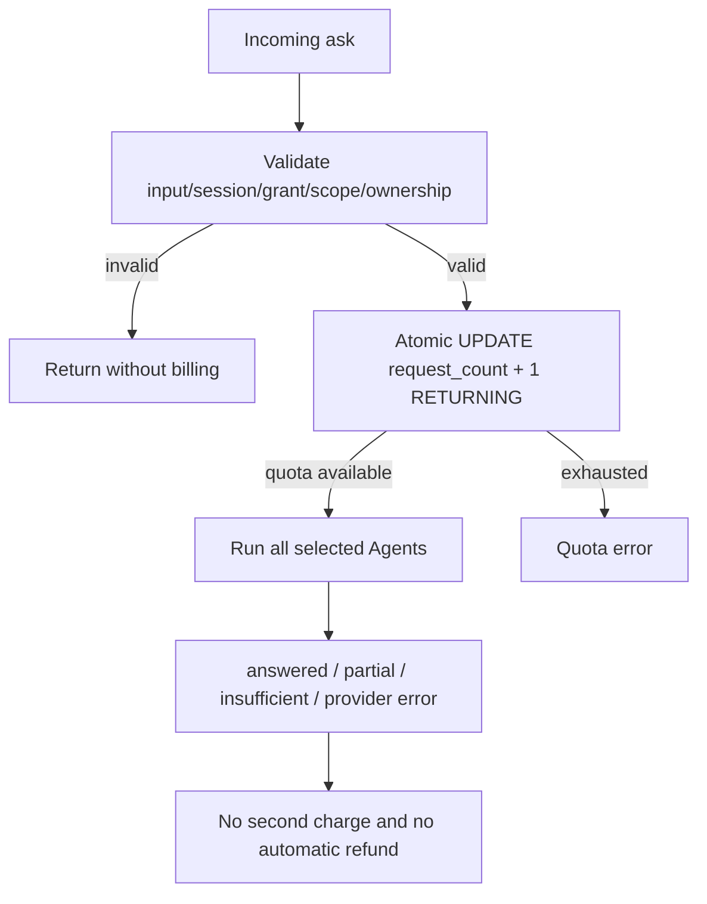

同一 `request_id` 的幂等重放返回缓存结果或受控失败，不再次扣费。

## 10. Grant 撤销

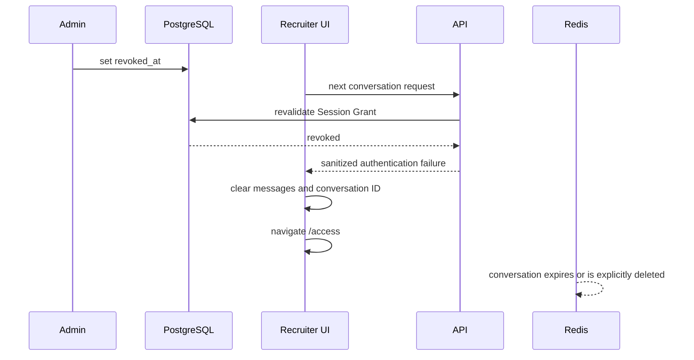

Redis 中旧 Session/Conversation 不能覆盖 PostgreSQL 撤销事实。

## 11. 前端聊天请求链路

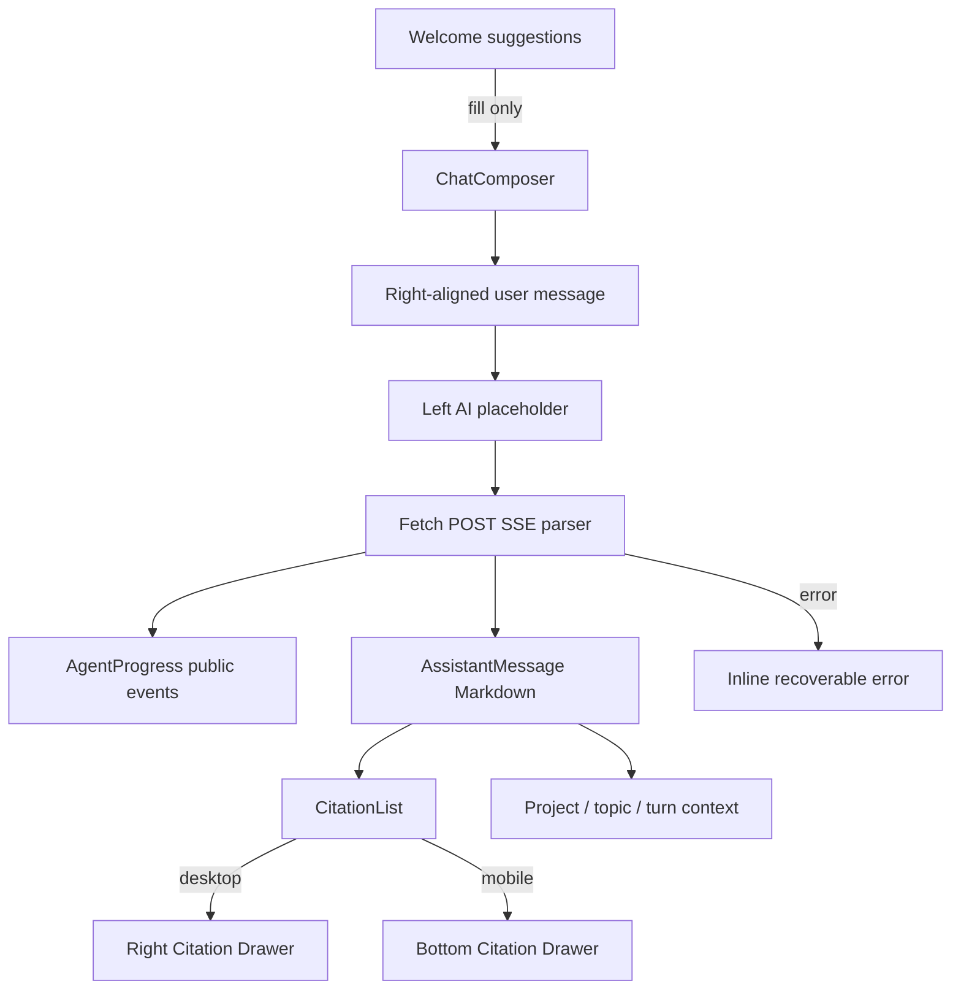

React 只保存当前页面消息；新建对话删除旧 Redis Conversation，清空消息和主题，但保留有效
Recruiter Session 与 Access Grant。
